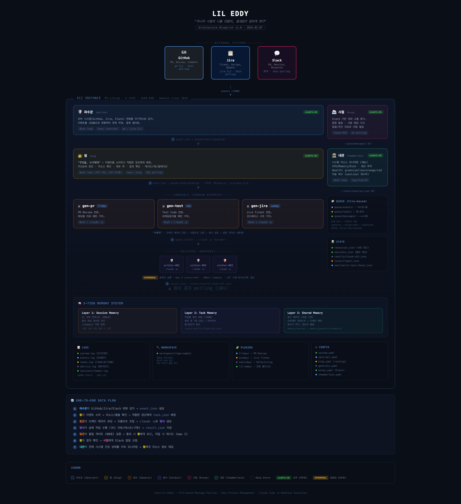

# Kingdom

> "주니어 시절의 나를 만들어, 쉴새없이 일하게 한다"

EC2 인스턴스 위에서 Claude Code 기반의 자율적인 개발 작업자를 운영하는 시스템.
GitHub PR 리뷰, Jira 티켓 구현, 테스트 코드 작성 등의 개발 업무를 자동으로 감지하고 수행한다.

## Architecture



6개의 역할이 파일 기반 메시지 패싱으로 협력한다:

| 역할 | 영문 | 하는 일 |
|------|------|---------|
| 파수꾼 | Sentinel | 외부 이벤트 감지 (GitHub, Jira polling) |
| 왕 | King | 이벤트 분류, 작업 배정, 리소스 관리 |
| 장군 | General | 도메인별 작업 관리, 프롬프트 조립, 병사 생성 |
| 병사 | Soldier | Claude Code `-p`로 실제 코드 작업 수행 (일회성) |
| 사절 | Envoy | Slack을 통한 사람과의 소통 전담 |
| 내관 | Chamberlain | 시스템 모니터링, 로그 관리, 자동 복구 |

## Tech Stack

| 분류 | 기술 |
|------|------|
| AI | Claude Code (headless `-p` 모드) |
| 세션 관리 | tmux |
| 스크립트 | Bash |
| 메시지 큐 | File-based MQ (JSON) |
| 외부 소통 | Slack Web API (curl) |
| 코드 관리 | GitHub CLI (`gh`) |
| 이슈 추적 | Jira REST API (curl) |
| 설정 | YAML (`yq`) |

## Design Principles

- **Polling, not Webhook** -- 외부 서버 노출 없이 안전하게 이벤트 감지
- **파일 기반 JSON** -- 디렉토리 위치가 곧 상태 (`pending/` -> `completed/`)
- **단순성 우선** -- Redis, RabbitMQ 등 외부 의존성 없음
- **최소 외부 의존성** -- Bash, jq, yq, tmux, Claude Code만으로 동작
- **플러거블 장군** -- YAML 매니페스트로 새 장군 추가 가능

## Directory Structure

```
/opt/kingdom/
├── bin/            # 실행 스크립트 (역할별 메인 루프 + 공통 라이브러리)
├── config/         # 시스템 설정 + 장군 매니페스트 + 프롬프트 템플릿
├── queue/          # 파일 기반 메시지 큐 (events, tasks, messages)
├── state/          # 상태 저장소 (heartbeat, 결과, 세션 레지스트리)
├── memory/         # 영구 메모리 (공유 + 장군별 도메인 메모리)
├── logs/           # 로그 (시스템, 이벤트, 세션별)
├── workspace/      # 장군별 격리된 코드 작업 공간
└── plugins/        # Claude Code 플러그인 (friday, saturday, sunday)
```

## Requirements

| 항목 | 스펙 |
|------|------|
| EC2 Instance | M5.xlarge (4 vCPU, 16GB RAM) |
| Storage | 100GB GP3 SSD |
| OS | Amazon Linux 2023 또는 Ubuntu 22.04 |
| Software | Claude Code, tmux, Git, gh CLI, jq, yq, bc, Node.js 22+ |
| API Keys | Claude API, GitHub Token, Jira API Token, Slack Bot Token |

## Status

**설계 완료, 구현 준비 중**

모든 역할의 스펙, 시스템 설계, 인프라 설정이 문서화되었다.

## Documentation

```
docs/
├── architecture.md              # 전체 아키텍처 설계
├── architecture-diagram.png     # 아키텍처 다이어그램
│
├── roles/                       # 역할 스펙 (6종)
│   ├── sentinel.md              # 파수꾼
│   ├── king.md                  # 왕
│   ├── general.md               # 장군
│   ├── soldier.md               # 병사
│   ├── envoy.md                 # 사절
│   └── chamberlain.md           # 내관
│
├── systems/                     # 시스템 설계 (7종)
│   ├── filesystem.md            # 파일 시스템 구조
│   ├── message-passing.md       # 메시지 패싱
│   ├── memory.md                # 3계층 메모리 전략
│   ├── data-lifecycle.md        # 데이터 생명주기
│   ├── logging.md               # 로깅 & 개선 체계
│   ├── event-types.md           # 이벤트 타입 카탈로그
│   └── internal-events.md       # 내부 이벤트 (JSONL)
│
├── infra/                       # 인프라
│   ├── ec2-setup.md             # EC2 설정 가이드
│   └── roadmap.md               # 구현 로드맵
│
└── confluence/                  # 히스토리 (컨셉 문서)
    ├── 20260206-concept.md
    └── 20260207-operation-design.md
```
