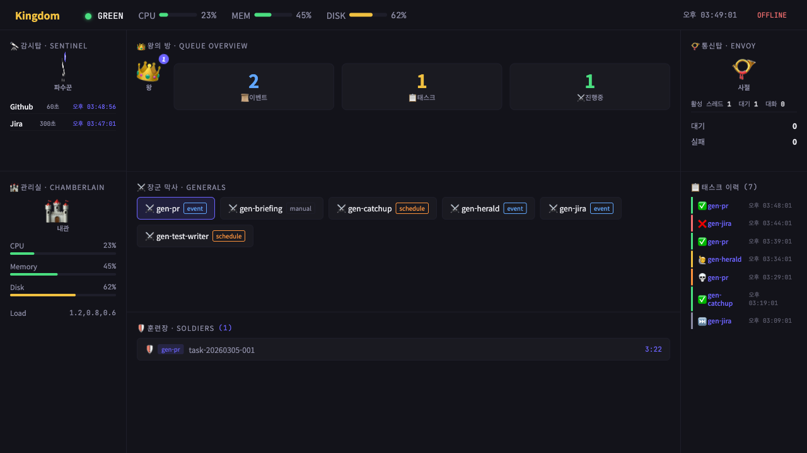

# Kingdom

> **빈 컴퓨터 한 대에 정착하여, 팀의 일원으로 일하는 AI 동료**

Kingdom은 GitHub·Jira·Slack을 감시하며 스스로 일감을 찾아 처리하는 자율형 AI 시스템이다.
PR이 올라오면 리뷰하고, Jira 티켓이 할당되면 구현하고, 모르는 건 Slack으로 물어본다.
일하며 배운 것은 메모리에 축적하여, 점점 더 잘 일한다.

```
 ┌─────────────────────────────────────────────────────────┐
 │  GitHub PR opened  ──→  파수꾼이 감지                     │
 │                         왕이 판단: "gen-pr 장군에게"       │
 │                         장군이 프롬프트 조립               │
│                         병사가 리뷰 수행 (Claude Code / Codex) │
 │                         결과를 Slack으로 보고              │
 │                                                          │
 │  전체 소요: 사람 개입 0                                    │
 └─────────────────────────────────────────────────────────┘
```

## Dashboard



## Why Kingdom?

| 기존 자동화 (CI/CD, GitHub Actions) | Kingdom |
|-------------------------------------|---------|
| 규칙 기반 (if-then) | LLM 추론 기반 |
| 코드를 실행 | 코드를 **읽고·쓰고·판단** |
| 빌드→테스트→배포 파이프라인 | 리뷰, 구현, 테스트 작성 등 **사고가 필요한 작업** |
| 트리거 → 고정 동작 | 트리거 → 맥락 이해 → 동적 대응 |
| 메모리 없음 | 3계층 메모리로 경험 축적 |

현재는 소프트웨어 개발(PR 리뷰, Jira 구현, 테스트 작성)에 집중하지만,
장군 패키지 시스템은 도메인 무관하게 설계되어 **지식 노동 전반으로 확장** 가능하다.

## Architecture

6개의 역할이 파일 기반 메시지 패싱으로 협력한다:

```
  GitHub/Jira ──→ 파수꾼(Sentinel) ──→ [이벤트 큐]
                                            │
  Slack ──→ 사절(Envoy) ──→ [이벤트 큐]     │
         Socket Mode (WebSocket)             │
                                        왕(King)
                                   라우팅 + 태스크 생성
                                            │
                                    [태스크 큐] ──→ 장군(General)
                                                      │
                                                 Soul + 프롬프트 조립
                                                      │
                                                 병사(Soldier)
                                              claude -p 실행
                                                      │
                                               [결과 JSON]
                                                      │
                             왕 ──→ [메시지 큐] ──→ 사절(Envoy) ──→ Slack
                                                        │
                             내관(Chamberlain): 헬스체크, 로그, 자동 복구
```

| 역할 | 하는 일 |
|------|---------|
| **파수꾼** Sentinel | GitHub·Jira 폴링으로 외부 이벤트 감지 |
| **왕** King | 이벤트 분류, 장군 라우팅, 작업 배정 |
| **장군** General | 도메인 전문가 — Soul 주입 + 프롬프트 조립 + 병사 관리 |
| **병사** Soldier | 선택된 실행 엔진(`claude`/`codex`)으로 실제 작업 수행 (일회성) |
| **사절** Envoy | Slack 양방향 소통 전담 — Socket Mode + bridge.js |
| **내관** Chamberlain | 시스템 모니터링, 로그 로테이션, 세션 관리 |

## Key Features

### Soul System — 아이덴티티 계층

병사는 "내가 누구인지" 알고 일한다. 공통 instruction source를 workspace의 `CLAUDE.md`와 `AGENTS.md`로 배치하여 Claude Code와 Codex 모두에 전달한다:

```
config/workspace-claude.md  → workspace/{CLAUDE.md,AGENTS.md} (공통 원칙 + 팀 맥락 + 결과 보고)
generals/gen-*/general-claude.md → workspace/gen-*/{CLAUDE.md,AGENTS.md} (장군별 성격, 압축 안전)
```

### General Packages — 플러거블 도메인 전문가

장군은 5파일로 자기완결적인 패키지다. 새 도메인은 패키지 추가만으로 확장된다:

```
generals/gen-{name}/
├── manifest.yaml   # 이벤트 구독, 스케줄, 메타데이터
├── prompt.md       # 병사 프롬프트 템플릿
├── prompt-codex.md # Codex 전용 템플릿 (선택적)
├── general-claude.md  # 장군 고유 성격 (선택적, 설치 시 CLAUDE.md로 변환)
├── general-codex.md   # Codex 전용 instruction (선택적, 설치 시 AGENTS.md로 반영)
├── install.sh      # 설치 스크립트
└── README.md       # 문서
```

**빌트인 장군 7종**:

| 장군 | 역할 | 트리거 |
|------|------|--------|
| `gen-pr` | PR 리뷰 | `github.pr.review_requested` |
| `gen-catchup` | 일간 PR 캐치업 요약 | 스케줄 (cron) |
| `gen-briefing` | 시스템 상태 브리핑 | DM petition |
| `gen-herald` | 일상 대화 및 범용 DM | `slack.channel.message`, `slack.app_mention` |
| `gen-test-writer` | 테스트 자동 작성 → PR | 스케줄 (30분 주기) |
| `gen-doctor` | 실패 태스크 진단 | DM petition |
| `gen-harness-querypie-mono` | querypie-mono 개발 하네스 | `jira.ticket.assigned`, `jira.ticket.updated` + petition 라우팅 |

### Multi-Engine Soldier Runtime

v4.0.0부터 병사는 `claude` 또는 `codex` 엔진을 선택해 실행할 수 있다. 기본 엔진은 `config/system.yaml`의 `runtime.engine`으로 결정한다.

```yaml
runtime:
  engine: "claude"   # or "codex"
```

- `claude`: `claude -p` + JSON stdout + resume session 지원
- `codex`: `codex exec --json` + AGENTS.md + best-effort resume token 지원
- 장군 패키지의 `agents/`, `skills/`, `general-claude.md` 자산은 `.claude/`와 `.codex/` 및 `AGENTS.md`로 함께 포팅된다

엔진별 자산 규칙:

- 공통 fallback: `prompt.md`
- Claude 전용: `prompt-claude.md`, `general-claude.md`, `agents/claude/`, `skills/claude/`
- Codex 전용: `prompt-codex.md`, `general-codex.md`, `agents/codex/`, `skills/codex/`

### Socket Mode — 실시간 Slack 연동

v2.0.0부터 Slack Socket Mode를 지원했고, v3.0.0부터는 Socket Mode 전용 구성으로 정리되었다. Node.js bridge가 WebSocket으로 Slack과 연결하여
DM과 @멘션을 실시간으로 수신한다:

```
[bridge.js] ←WebSocket→ Slack
     │
     └──→ socket-inbox/  ←── envoy.sh (인바운드 처리)
     ←─── outbox/        ──→ envoy.sh (아웃바운드 처리)
```

`socket_mode.enabled: false`로 설정하면 기존 폴링 모드로 동작한다.

### sleep_or_wake — 반응형 루프

fswatch + FIFO 기반으로, 파일 도착 시 즉시 깨어나는 반응형 루프:

```bash
sleep_or_wake "$LOOP_TICK" "$BASE_DIR/queue/events/pending" "$BASE_DIR/state/results"
```

이벤트 반응 시간 5~10초 → 1초 미만. fswatch 미설치 시 기존 sleep으로 graceful fallback.

### 3-Layer Memory — 경험으로 성장

```
Session Memory   → 병사 실행 중 임시 컨텍스트
Task Memory      → 작업 단위 결과·교훈 보존
Shared Memory    → 장군 도메인별 장기 지식 축적
```

병사가 작업 완료 시 `memory_updates[]`로 교훈을 기록하면, 같은 장군의 다음 병사가 이를 참조한다.

### File-based MQ — 외부 의존성 제로

```
queue/events/pending/   → (파수꾼 write)  → (왕 read)    → completed/
queue/tasks/pending/    → (왕 write)      → (장군 read)  → completed/
queue/messages/pending/ → (왕 write)      → (사절 read)  → sent/ | failed/
```

디렉토리 위치가 곧 상태. `cat`/`ls`로 즉시 디버깅 가능.
Write-then-Rename 원자성, 실패 메시지 재시도(3회), 영구 실패 격리.

## Design Principles

- **Polling + Socket Mode** — GitHub/Jira는 폴링, Slack은 Socket Mode(WebSocket)로 실시간 수신
- **파일이 곧 상태** — Redis, RabbitMQ 없이 디렉토리 이동으로 상태 전이
- **최소 의존성** — Bash, jq, yq, tmux, Claude Code, Node.js로 동작
- **Schema-First** — JSON Schema가 진실의 소스, 하위 레이어 종속
- **macOS/Linux 호환** — portable wrapper (date, stat, flock), bash 3.2 호환

## Tech Stack

| 분류 | 기술 |
|------|------|
| AI | Claude Code / Codex (headless non-interactive mode) |
| 세션 관리 | tmux |
| 스크립트 | Bash (macOS 3.2 호환) |
| 메시지 큐 | File-based MQ (JSON, atomic write) |
| Slack 연동 | Socket Mode (`@slack/socket-mode`) + Web API (`@slack/web-api`) |
| 코드 관리 | GitHub CLI (`gh`) |
| 이슈 추적 | Jira REST API |
| 설정 | YAML + JSON Schema |
| 테스트 | bats-core + bats-assert |
| 파일 감시 | fswatch (선택, sleep_or_wake용) |

## Quick Start

```bash
git clone https://github.com/eddy-jeon/kingdom.git
cd kingdom
bin/setup.sh
```

setup.sh가 대화형 8단계로 안내합니다:
1. 설치 경로 선택 + 소스 복사
2. 의존성 확인 (CLI + Node.js)
3. GitHub/Jira/Slack 인증 설정
4. 감시 대상 레포 및 Slack 채널 설정
5. 디렉토리 초기화
6. 장군 패키지 설치
7. 대시보드 빌드
8. 최종 검증

### 업그레이드

```bash
# 코드만 갱신, 설정/인증 보존 (각 단계 선택 가능)
bin/setup.sh --upgrade

# 무인 업그레이드 (모든 질문에 Y)
bin/setup.sh --upgrade --yes
```

자세한 설치 가이드: [`docs/guides/install-guide.md`](docs/guides/install-guide.md)

## Requirements

| 항목 | 스펙 |
|------|------|
| 하드웨어 | M5.xlarge (4 vCPU, 16GB) 또는 macOS Apple Silicon |
| 스토리지 | 100GB GP3 SSD |
| OS | Amazon Linux 2023, Ubuntu 22.04+, macOS 14+ |
| 소프트웨어 | Claude Code, tmux, Git, gh CLI, jq, yq, bc, Node.js 22+ |
| 선택 사항 | fswatch (sleep_or_wake 즉시 깨움), Docker (대시보드) |
| 인증 | Claude OAuth (Max Plan), GitHub (`gh auth`), Jira API Token, Slack Bot Token |
| Socket Mode | Slack App-Level Token (`xapp-...`, @멘션 수신용) |

## Tests

```bash
# 전체 테스트 (345개)
bats tests/test_*.sh tests/lib/test_*.sh tests/lib/*/test_*.sh
```

| 영역 | 테스트 수 |
|------|----------|
| 공통 라이브러리 (sleep_or_wake 포함) | 32 |
| 설치/제거 | 30 |
| 파수꾼 (Sentinel) | 6 |
| 사절 (Envoy, Socket Mode 포함) | 15 |
| 왕 (King, app_mention 포함) | 68 |
| 장군 + 병사 | 48 |
| 내관 (Chamberlain) | 45 |
| 시스템 스크립트 | 14 |
| lib 단위 테스트 | 87 |
| **합계** | **345** |

## Documentation

| 경로 | 내용 |
|------|------|
| [`docs/guides/`](docs/guides/) | 운영 가이드 — 설치, 로컬 개발 |
| [`docs/guides/tencent-cloud-migration-guide.md`](docs/guides/tencent-cloud-migration-guide.md) | Tencent Cloud 마이그레이션 가이드 |
| [`docs/guides/operational-validation-checklist.md`](docs/guides/operational-validation-checklist.md) | multi-engine 운영 검증 체크리스트 |
| [`docs/spec/`](docs/spec/) | 설계 명세 — 아키텍처, 역할, 시스템 |
| [`docs/analysis/`](docs/analysis/) | 분석 — OpenClaw 비교, 기술 선택 근거 |
| [`docs/releases/`](docs/releases/) | 릴리스 노트 |
| [`docs/archive/`](docs/archive/) | 히스토리 — 컨셉 초안, 인프라 메모 |

## Project Structure

```
kingdom/
├── bin/                     # 실행 스크립트
│   ├── start.sh / stop.sh   #   시스템 관리
│   ├── setup.sh             #   설치 위저드 (--upgrade 지원)
│   ├── sentinel.sh          #   파수꾼
│   ├── king.sh              #   왕 (thin wrapper)
│   ├── envoy.sh             #   사절
│   ├── chamberlain.sh       #   내관
│   ├── spawn-soldier.sh     #   병사 생성
│   ├── generals/            #   장군 엔트리포인트
│   └── lib/                 #   공유 라이브러리
│       ├── common.sh            # 공통 (로깅, 설정, sleep_or_wake)
│       ├── king/functions.sh    # 왕 오케스트레이션
│       ├── king/messages.sh     # 왕 메시지/시퀀스 보조
│       ├── king/schedules.sh    # 왕 스케줄 보조
│       ├── envoy/bridge.js      # Socket Mode 브릿지 (Node.js)
│       ├── envoy/message-processors.sh # 메시지 타입별 처리
│       ├── envoy/socket-inbox.sh # Socket Mode 인바운드 처리
│       ├── envoy/slack-api.sh   # Slack API (outbox/curl 이중 디스패치)
│       ├── general/common.sh    # 장군 공통 진입점
│       ├── general/main-loop.sh # 장군 메인 루프
│       ├── general/prompt-builder.sh  # Soul + 프롬프트 조립
│       └── ...
├── generals/                # 장군 패키지 (소스, 7종)
│   ├── gen-pr/              #   PR 리뷰
│   ├── gen-catchup/         #   일간 PR 캐치업
│   ├── gen-briefing/        #   시스템 브리핑
│   ├── gen-herald/          #   범용 DM 응대
│   ├── gen-test-writer/     #   테스트 자동 작성
│   ├── gen-doctor/          #   실패 진단
│   └── gen-harness-querypie-mono/ #   querypie-mono 개발 하네스
├── config/                  # 설정
│   ├── workspace-claude.md  #   병사 CLAUDE.md (Soul + 팀 맥락 + 결과 보고)
│   ├── *.yaml               #   역할별 설정
│   └── generals/            #   설치된 장군 매니페스트
├── schemas/                 # JSON Schema (SSOT)
├── package.json             # Node.js 의존성 (Socket Mode)
├── tests/                   # 362개 테스트
└── docs/                    # 문서
```

## Status

**v4.0.0** — 멀티 엔진 런타임 릴리스. `claude`/`codex` 병행 지원, `AGENTS.md`/skills/agents 포팅, runtime engine 추상화, Socket Mode 전용 Slack 경로 유지.
